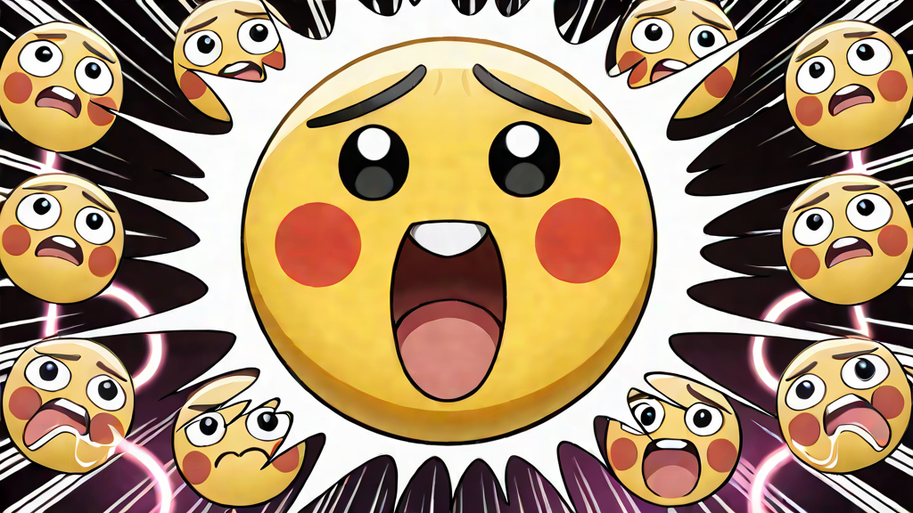
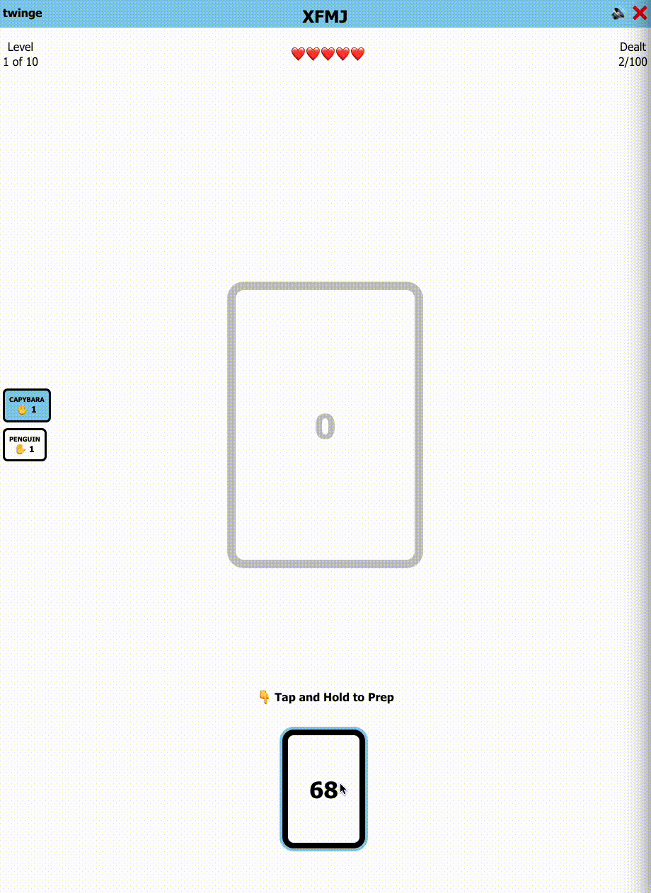

# Twinge

Twinge is a co-operative card game based off [The Mind](https://boardgamegeek.com/boardgame/244992/the-mind) by Wolfgang Warsch.

Players work together to play through a deck of up to 1000 cards in ascending order. Each player is dealt a hand of cards, and anyone can play into the center pile at any time.

Once the dealt cards are played, a new hand is dealt to every player - increasing by one more card per player each round. Played cards are not returned to the deck - and if all cards in the deck are played you win!

Missed cards get automatically flagged and cause the team to lose a life. If all lives are lost the game is over. The difficulty can be adjusted by granting extra lives, up to 100.

## Tips
Cancel a prepared move by (mouse) moving the away from the pressed area, or holding for 4 seconds (touch & mouse).

Anyone may warn a player by long pressing their nametag for 2 seconds. A second warning in the same round kicks the player from the game.Kicked players' cards are discarded.

Players with red names have disconnected from the game, to help identify whether to kick them or wait for them to rejoin.

It is possible to join mid-game via the room code. You will not be dealt a hand until the next round, and cannot customise your name.

## Technology
Check out the [technical documentation](./docs/README.md) for more info.