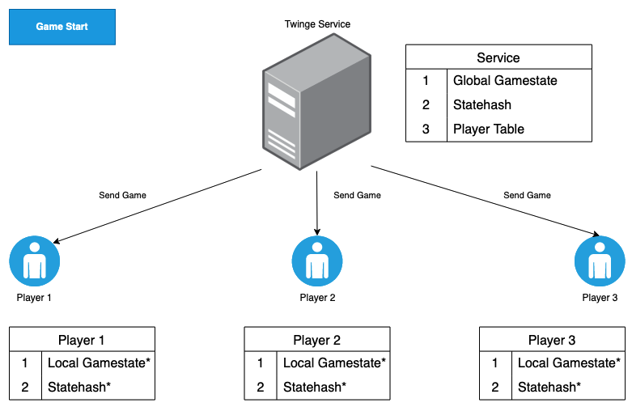
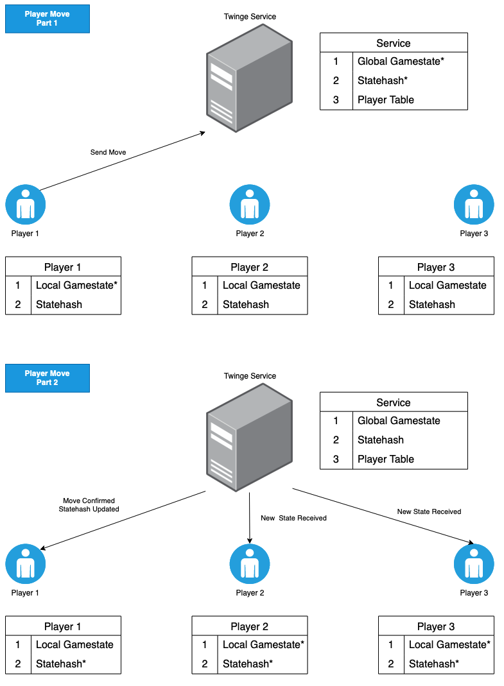
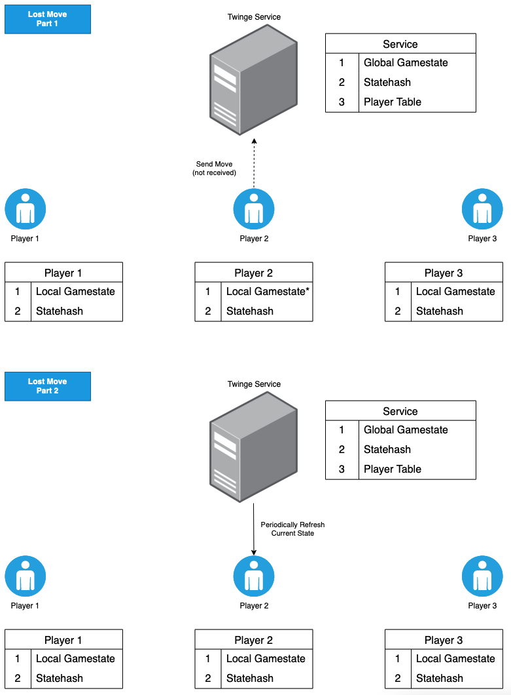

# Twinge
This is a co-operative card game based off The Mind by Wolfgang Warsch. Players work together to get through a deck of 10-1000 cards in ascending order. Hands are dealt with increasing size, and cards are played at any time; without replacement. Difficulty may be adjusted by granting up to 100 extra lives to compensate for missing cards out of order.

## Handy Hints
Cancel a prepared move by (mouse) moving the away from the pressed area, or (touch) tapping with a second finger.

Anyone may kick a player by holding their nametag for 2 seconds. This needs to be done twice in one round to confirm the kick. Kicked players' cards are discarded.

Players with red names have disconnected from the game, either kick them or wait for them to rejoin.

It is possible to join mid-game via room code, but without the ability to customise your name. You will not be dealt a hand until the next round.

## Architecture

### Twinge Client
React.js Single Page App
- CloudFront
- S3

The web client for Twinge is a static site hosted in S3 and served from Cloudfront. Cloudfront provides caching capability and convenient TLS termination with custom domain name support via ACM and Route 53. 

The React app is relatively simple (there is literally one button you need to press) and was written using class components (which were still cool at the time). `Gamestate` is passed down through props to few layers of components as there was not enough complexity to warrant using a state management library. Audio is provided through an `AudioContext` wrapper using sounds recorded from everyday household objects.

### Twinge Service
Serverless Framework Node.js
- API Gateway
- Lambda
- DynamoDB

The twinge service leverages API Gateway's ability to serverlessly manage WebSockets connections. This enables full duplex communication without the need to run idle compute to wait between messages. API gateway manages the lifecycle of a client connection, triggering connection and disconnection events which are picked up by the `connect` handler. Player connections are translated into DynamoDB entries which track which `game` room they are particiapting in - allowing them to reconnect.

During play, the twinge service will broadcast the room's `game` object to all players. A `statehash` of the global `Gamestate` is sent for integrity, and a sanitised version of the `Gamestate` is delivered to each player (so they can't see hidden information like the deck or other players' hands). 

When a player makes a move, their `Gamestate` is updated locally, and then a message is sent to the service alongside the previous state's `statehash`. The service then checks the validity of the move, and whether it was based on the `statehash` of the current `Gamestate`. If the move is current and valid, the global `Gamestate` is updated, and a new `game` object is broadcasted to every connected player.

Due to the asynchronous nature of the gameplay, multiple moves may arrive in a short amount of time. If a move based off an old `statehash` is recieved, it is discarded - and the player is re-sent a copy of the current `game`. This prevents a "rubber banding" effect where moves get applied then suddenly overwritten.

When any player recieves a `game` from the service this is interpreted as the source of truth and their `Gamestate` is updated locally. For an uncontested move this verifies the actor's local state with no visual change, and causes all other players to update. If a move was submitted but rejected by the service, then the actor's local view undergoes a correction - i.e. they may get their card back. This allows them to reconsider their move with the latest information.

If a move is submitted but never recieved by the service (perhaps due to network issues) the acting player's gamestate will remain out of sync until they receive their next `game` message. To mitigate the risk of standoff drift, the client requests a refresh of the `game` every 360 seconds.

This implementation provides a robust, secure, and compelling multiplayer gaming experience in an extremely cost-effective way. The AWS free tier provides generous usage limits that are more than enough to keep the cost of running twinge to a few cents per month.